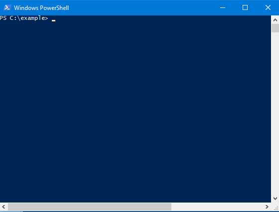

# GuiCompletion for PowerShell
<!-- Remember that description section must render correctly as plain text because it's copy-pasted into the module manifest. -->
<!--BEGIN DESCRIPTION-->
This enables a GUI-style tab-completion menu for PowerShell.  It integrates with PSReadLine which comes installed in PowerShell by default, and the GUI code is lifted straight from PowerTab.

Bugs?  Please open an issue on Github: https://github.com/cspotcode/PS-GuiCompletion/issues
<!--END DESCRIPTION-->

<!-- TODO add screenshot -->

## Installation 

Install from the PowerShell Gallery. ([GuiCompletion's Gallery page](https://www.powershellgallery.com/packages/GuiCompletion))

    Install-Module -Name GuiCompletion -Scope CurrentUser

*You can omit `-Scope` but I use it to avoid requiring Administrator permissions.*

## Usage

Register it with the default Ctrl+Spacebar key shortcut:

    Install-GuiCompletion

...or with another key shortcut:

    Install-GuiCompletion -Key Tab

`Install-GuiCompletion` is a one-line helper that wrap PSReadLine's [`Set-PSReadLineKeyHandler` cmdlet](https://github.com/lzybkr/PSReadLine#usage).  For more advanced scenarios, you can call the relevant PSReadLine commands directly:

    Set-PSReadlineKeyHandler -Key Alt+Spacebar -ScriptBlock { Invoke-GuiCompletion }

You'll want to add these configuration commands to your PowerShell profile.  Otherwise your configuration will not be applied to new PowerShell sessions.

## TODOs

Mac and Linux support.  GetKeyState and some of the rendering code is apparently Windows-only.

## Changelog

### v0.8.1

- Fixes broken publication of v0.8.0

### v0.8.0

- Switches to Windows' default menu color scheme ([#5](https://github.com/cspotcode/PS-GuiCompletion/issues/5), [@nightroman](https://github.com/nightroman))
  - If you want to use the old theme or customize colors, modify the `$GuiCompletionConfig.Colors` global variable.
- Fixes rendering glitch where some vertical lines could be left over after the menu closes ([#6](https://github.com/cspotcode/PS-GuiCompletion/issues/6), [@nightroman](https://github.com/nightroman))
- Switches to `TabExpansion2` for computing completions, which allows other modules to plugin custom completions ([#7](https://github.com/cspotcode/PS-GuiCompletion/issues/7), [@nightroman](https://github.com/nightroman))